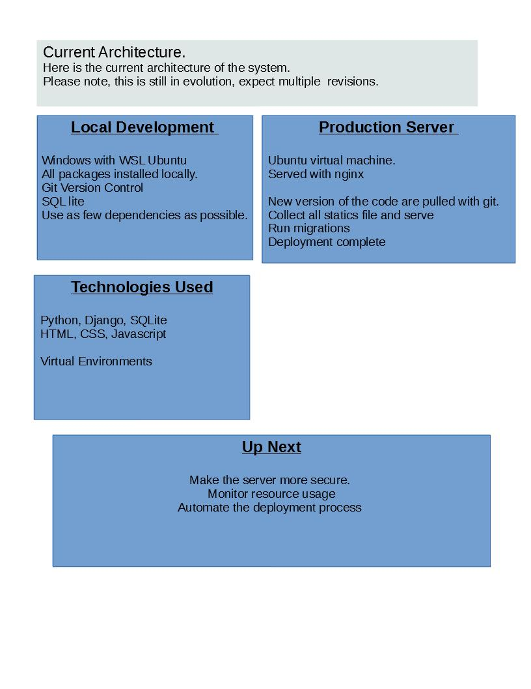

# anditherobot.com
## Goals
Part of a developer's portfolio is to make his own website. 
I have setup some contraints. 
* Hosted on a VPS
* Maintain my own cloud infrastructure
* Write code Front-End Code and apply good UI/UX principles.
* Write Server Side Code

# Architecture

